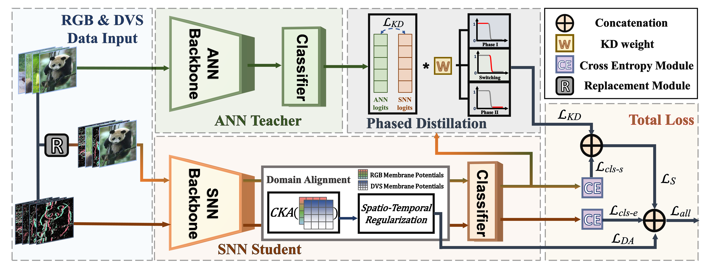

# Cross Knowledge Distillation between Artificial and Spiking Neural Networks

  
*Comparison of ACC, spike ratios, and other metrics across modalities.*

> ​**Code:** 🔜 Coming soon!  
> *(We'll release the implementation code shortly.)*
